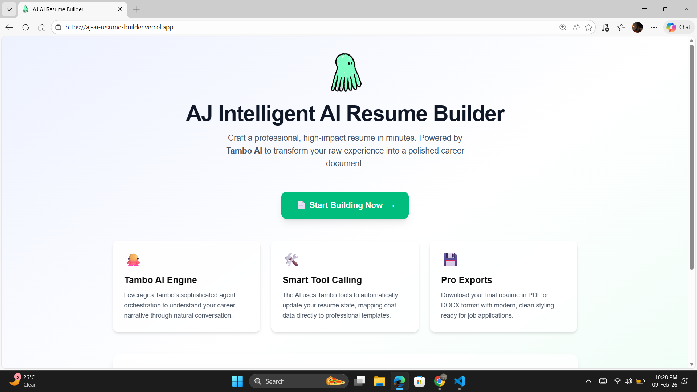
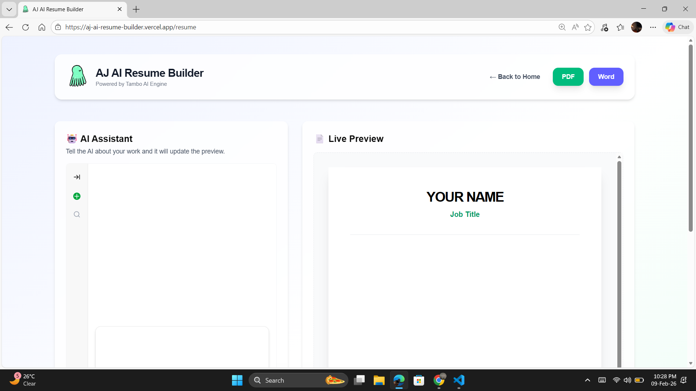
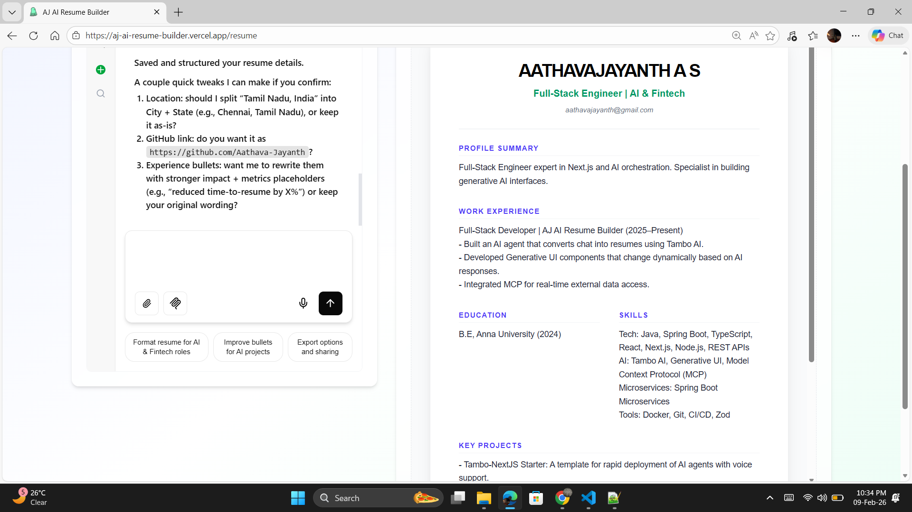

# 🚀 AJ AI Resume Builder  
### AI-Powered Resume Builder for Modern Job Seekers  

> 🏆 Built for **Tambo Hackathon – “The UI Strikes Back”** by WeMakeDevs

---

## 📌 Live Demo  
🔗 **Website:** https://aj-ai-resume-builder.vercel.app/

## 🎥 Demo Video  
▶️ **YouTube:** https://youtu.be/ktBJF8ZtHZA?si=bJXJKVkRJnet7CGy

---

## 🧠 About the Project

**AJ AI Resume Builder** is a smart, AI-powered web application that helps users create professional resumes in minutes.

Instead of manually writing resumes, users can:

- Enter their details
- Get AI-generated content
- Export resumes instantly

This project focuses on **great UI/UX + AI automation** to improve the job application process.

---

## ✨ Key Features

✅ AI-powered resume generation  
✅ Real-time resume preview  
✅ Editable sections  
✅ Live Resume templates  
✅ PDF/WORD export  
✅ Responsive design  
✅ Clean and modern UI    
✅ Fast performance  

---

## 🛠️ Tech Stack

| Technology | Purpose |
|------------|----------|
| Next.js 15 | Frontend Framework |
| React | UI Development |
| Tailwind CSS | Styling |
| Tambo AI | AI Integration |
| TypeScript | Type Safety |
| Vercel | Deployment |

---

## 🎯 Hackathon Alignment

This project aligns perfectly with the **Tambo Hackathon – The UI Strikes Back** theme:

### ✔ UI Excellence
- Clean and modern interface
- Smooth animations
- Responsive layout
- User-friendly flow

### ✔ AI + Tools Integration
- Tambo AI for resume generation
- Intelligent content suggestions
- Automated formatting

### ✔ Practical Impact
- Helps students and professionals
- Saves time
- Improves resume quality

---

## 📸 Screenshots





---

## ⚙️ Installation & Setup

Follow these steps to run the project locally:

### 1️⃣ Clone the Repository

```bash
git clone https://github.com/Aathava-Jayanth/AJ-AI-Resume-Builder.git
```

### 2️⃣ Navigate to Project Folder

```bash
cd AJ-AI-Resume-Builder
```

### 3️⃣ Install Dependencies

```bash
npm install
```

### 4️⃣ Run Development Server

```bash
npm run dev
```

### The application will run at:

```bash
http://localhost:3000
```

---

## 📂 Project Structure

```bash
AJ-AI-Resume-Builder/
├── src/
│   ├── app/
│   ├── components/
│   ├── lib/
│   ├── store/
│   └── tools/
├── public/
├── README.md
└── package.json

```
---

## 🧩 Challenges Faced
- Integrating AI responses smoothly

- Streaming response handling

- UI performance optimization

- Tailwind + Next.js configuration

- Color compatibility issues

All issues were resolved through debugging and optimization.

---

## 📈 Future Improvements

- More resume templates

- Multi-language support

- Cover letter generator

- Resume scoring system

- ATS optimization

- User accounts & cloud storage

---

## 👨‍💻 Author

### Aathava Jayanth

- GitHub: https://github.com/Aathava-Jayanth

- LinkedIn: https://www.linkedin.com/feed/update/urn:li:activity:7425996054095015936/

--- 

## 🙏 Acknowledgements

- Tambo AI Team

- WeMakeDevs Community

---

⭐ If you like this project, please give it a star on GitHub!

